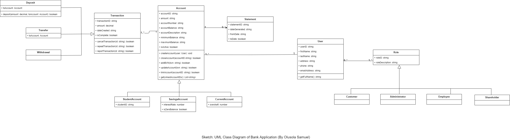

# Banking App
This project was developed following TDD, especially has outlined by Bob Martin (Uncle Bob). Red-Green-Refactor.

I Took this project (Assigned by a Lecture in my University) as an opportunity to learn TDD properly.

## Running app
`cd ./BankingApp` then run `dotnet run`

## Running tests
`cd ./BankingApp.Tests` then run `dotnet test`

## Ducumentation
`cd ./docs` then run `docfx docfx.json --serve`
Or see the xml file here `./BankingApp./bin./Debug./net5.0./BankingApp.xml`

## (Sketch) Class Diagram
A Class Diagram of the classes and their relationships in the app is included in the project folder, named **BankingAppSketchClassDiagrams.png**.

Below is the preview of the image

